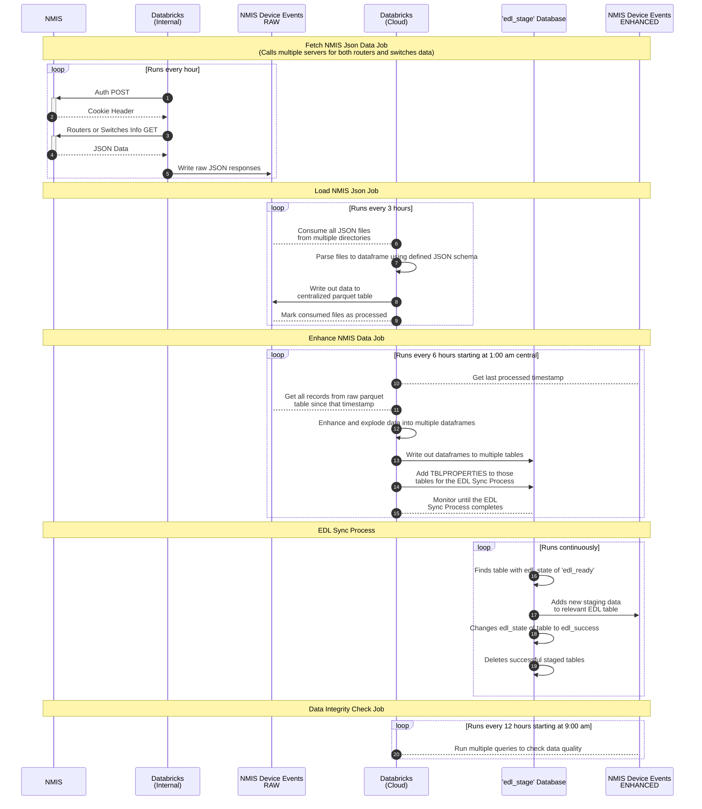
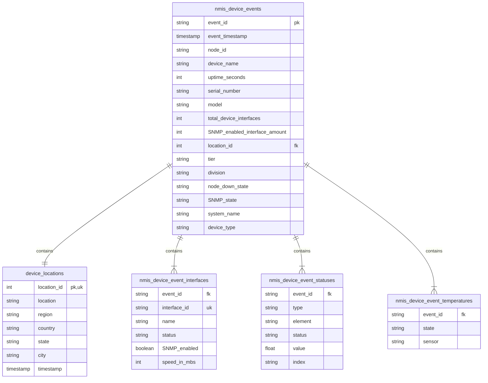

# NMIS Data Ingest

Repo used to house notebooks and files used in our data pipeline through Databricks to ingest NMIS data to the EDL.

## Deployment

On merge to main will deploy Databricks infrastructure to production using templates found in Terraform directory. Infrastructure mostly consists of scheduled jobs that point to notebooks in this repository. Repository is sent to Databricks where they are hosted on a team repo. 

## Contributing

This repo uses [Poetry](https://python-poetry.org/) to manage dependencies. Make sure you have poetry installed according to the installation documentation, then run `poetry install` in the root of this repository.

### Organization

This repo is organized into a package, but that is a little misleading, as the main logic all lives in notebooks that run independently on Databricks.  The package hierarchy is only there to aid in running locally and testing. Here is some insight into our current structure:

- notebooks
  - All files found in this directory are ipynb notebooks. The logic inside each is expected to contain:
    1. A class or at least function definition that houses the main logic of that notebook. This is usually the first cell, but can span multiple if neccessary.
    2. One to multiple invocations of that logic meant to only ever be run against a databricks cluster.  This logic should be minimal, just enough to pass in parameters for different functionality, and usually the pre-existing Databricks spark session and/or dbutils. 
  - The logic in these notebooks cannot import any other files in this repo. They must be self sufficient to run on databricks clusters.
- tests
  - .py files run as tests.
    - They should leverage the ipynb library to import the notebook logic described above using `ipynb.fs.defs.{package_path_of_notebook}`.
      - Example: `from ipynb.fs.defs.notebooks.fetch_nmis_json_data import ServerInfo, DataRetriever`
      - This will only import function and class definitions. It will not execute function calls or any scripting.
- notebooks/local
  - Versions of the main notebooks meant to be run locally for development.
    - Should pull in the logic declared in the main level notebooks using the same method described above in tests, then provide arguments that allow the logic to run against a local python kernel, instead of a Databricks cluster.
    - This logic should be minimal, and usually consists of providing relative paths for files, and/or alternative versions of resources normally found on databricks clusters, described in more detail below.
- notebooks/local/utils
  - Utility classes or functions that aid in running databricks notebooks locally with minimal fuss.
    - spark_local
      - Simple helper to create a local spark session
    - dbutils_local
      - Replacement class for the Databricks dbutils that is automatically available on thier clusters. Usually used for interacting with file sytems or secrets.
        - This version does not exactly mimic all things the real dbutils does, but it is meant to be a way to not have to declare logic multiple times, and be able to leverage dbutils in our main notebooks without having to worry about complicating local notebook setups.

### Kernel Selection

If using VSCode, if you are wanting to run locally you should select the poetry kernel, instead of the default python kernel, when executing notebooks.
  - It will be the one with a path that starts with `~/.cache/pypoetry.../` and contains this project's name.
  - You may need a restart to discover the kernel after you run your first poetry install.

### Tasks

We leverage the [invoke](https://www.pyinvoke.org/) library to define tasks in the `tasks.py` file that you can use with `poetry run invoke {task}`. 

Some helpful ones include:
- `poetry run invoke lint`
  - Run linting and auto format files. Can send in the `--dry` option to not auto format.
- `poetry run invoke test`
  - Run all tests
      - You may pass in a `-k` parameter to specify a file or method name pattern to match if you wish.  Example: `poetry run invoke test -k enhance_`.
- `poetry run invoke verify`
  - Do all the things you would want to do before you check in your code, including linting, testing, and clearing ipynb outputs and widgets. 

### Automated Pipeline and Tasks

This repo requests PRs to merge to main.

- Black linting is enforced, even in notebook files.
- Unit testing is also enforced. All tests must pass before merging into the `main` branch.

Leverage the tasks defined in the `Tasks` section to verify you will pass these before you check in.

# Data Flow Diagram

# ERD 
